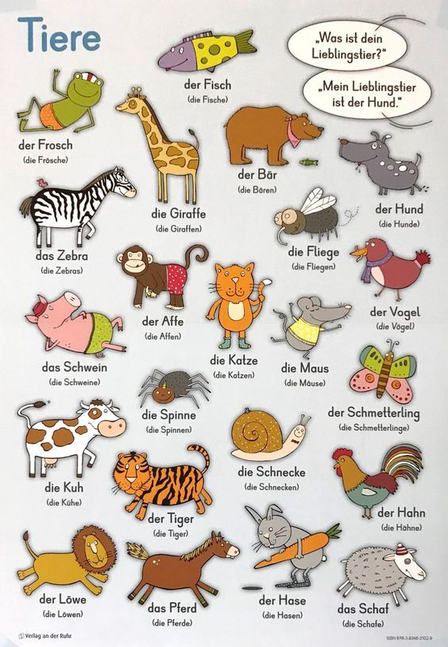

# Animals\(de\)

## **Eating like…!**

|  | Fressen | essen |
| :--- | :--- | :--- |
| ich | fresse | esse |
| du | frisst | isst |
| er/sie/es | frisst | isst |
| wir | fressen | essen |
| ihr | fresst | esst |
| sie/Sie | fressen | essen |

**Essen** and **fressen** both mean to eat, but they’re not the same!

**Fressen** is for animals, so using **fressen** with a person shows you think they eat like an animal.

**Der Hund** **frisst** **Brot.** The dog eats bread.

**Der Mann** **isst** **Brot.** The man eats bread.

**Der Mann** **frisst** **Brot.** The man eats bread \(like an animal\).

## **Frankenwords**

German is famous for long words! You can make these words by putting nouns together, like how Frankenstein put his monster together!

| **das Haus** **das Tier** | **das Haustier** |
| :--- | :--- |
| **die Orange** **der Saft** | **der Orangensaft** |

The gender is always whatever gender the last word in the combo‑word is!

## Das Tier\(-e\)

**Sie hat ein Haustier**.

> Haustier: **n, -e**

She has a pet.

**Du hast Pferde.** You have horses.

**Das Pferd trinkt Wasser.** The horse drinks water.

> Pferd: **das; -\(e\)s,-e**

**Die Kinder haben Fische.**

> Fisch: **der; -\(e\)s, -e**

The children have fish.

**Die Maus frisst den Käse.**

> Maus: **die; -,Mäuse**

The mouse is eating the cheese.

**Ich habe einen Hund.**

> Hund: **m, -\(e\)s, -e**
>
> Katze: **f, -, n**

I have a dog.

**Der Mann hat eine Spinne.**

> Spinne: **f, -**

The man has a spider.

**Die Frau hat eine Kuh\(kühe\).**

> Kuh: **die; -,Kühe**

The woman has a cow.

**Die Bären fressen die Fische.**

> Bär: **der; -en, -en**

The bears are eating the fish.

**Eine Ente/Der Vogel/Das Schwein frisst einen Apfel.**

> Ente: **f, -, -n**
>
> Vogel: **der; -s,Vögel**
>
> Schwein: **n, -e**

A duck/the bird/the pig eats an apple.

**Die Ente frisst eine Fliege\(-n\).**

> Fliege: **f,-,-en**

The duck is eating a fly.

**Eine Biene ist ein Insekt.**

> Biene: **f,-n**
>
> Insekt: **n; -\(e\)s,-en**

A bee is an insect.

**Die Spinne frisst den Käfer.**

> Käfer: m, -

The spider is eating the beetle.

