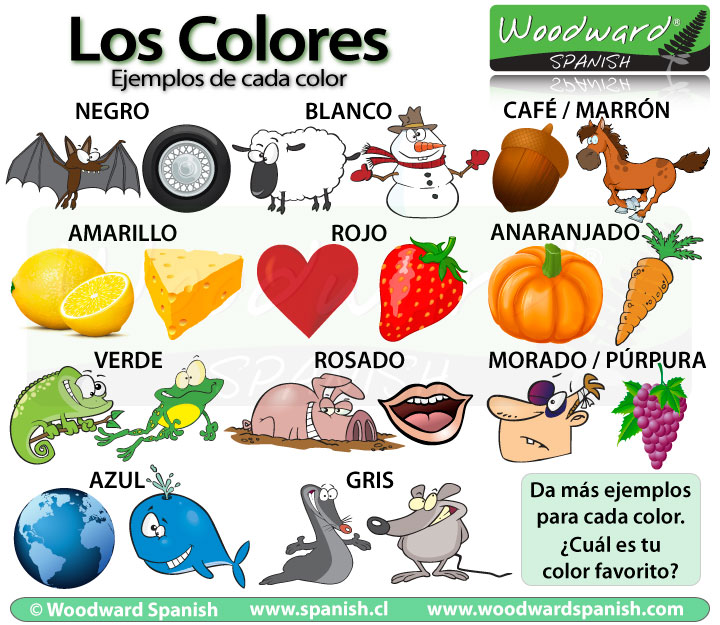

# Clothes & Colors

## Colors

The main colors in Spanish are:

* **negro** - black
* **marrón / café** - brown
* **gris** - gray / grey
* **blanco** - white
* **amarillo** - yellow
* **anaranjado / naranjo** - orange
* **rojo** - red
* **rosado** - pink
* **morado / púrpura** - purple
* **azul** - blue
* **verde** - green

### Claro - Oscuro - Fuerte

When we talk about colors, we can also include different tones, shades and intensities by using the following expressions:

* claro = light
* oscuro = dark
* fuerte = bright

**Claro** is the opposite of **Oscuro**

**Fuerte** is a bright intense color that is easy to see.

* Verónica tiene ojos **verdes oscuros**.
* Su pelo **gris claro** la hacía ver mayor.
* Su corbata **rosada fuerte** no le queda bien.

You will notice that the words **claro, oscuro** and **fuerte** go after the color.

Spanish has a word specifically used for the color **light blue** ... **celeste**.

## La Ropa

General types of clothing include ropa deportiva or ropa sport \(sportswear\), ropa informal \(casual clothing\), ropa formal \(formalwear\), ropa de negocios \(businesswear\), and ropa casual de negocios \(business casual clothing\).

> Una tienda de ropa.
>
> A clothing/clothes store.

| Clothing in Spanish |  | Clothing in Spanish |  |
| :--- | :--- | :--- | :--- |
| el cinturón | belt | la blusa | blouse |
| el abrigo | coat | las botas | boots |
| el sostén, el sujetador, el brasier | bra | la chaqueta | jacket |
| el vestido | dress | la pijama | pajamas |
| el traje, el vestido, el vestido de noche, el vestido de baile | gown \(formal dress\) | los pantalones | pants, trousers |
| el bolso/la cartera | purse | la camisa | shirt |
| el zapato | shoe | la falda | skirt |
| el calcetín | sock | la corbata | tie |
| el traje | suit | la camiseta | T-shirt |
| el suéter, el jersey, la chompa | sweater | el reloj | watch |
| el sombrero | hat | la alfombra | carpet/rug |

## fashion

**Los pantalones rojos no son buenos.**

The red pants are not cute.

**¿Cuántas carteras necesitas?**

How many wallets do you need?

**Los estudiantes necesitan camisas nuevas para la escuela.**

The students need new shirts for school.

**Estas camisetas son pequeñas.**

These shirts are small.

**Tú tienes muchos vestidos interesantes.**

You have many interesting dresses.

**Los zapatos rojos son nuevos.**

The red shoes are new.

**Mi hija quiere dos vestidos bonitos para el baile.**

My daughter wants two beautiful dresses for the dance.

**Mi novio siempre usa camisetas rojas.**

My boyfriend always wears red shirts.

**Yo tengo camisetas pequeñas y grandes.**

I have small and large shirts.

**Yo necesito unos vestidos bonitos para la fiesta.**

I need some pretty dresses for the party.

