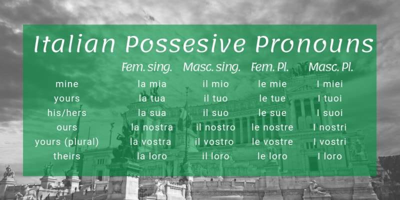

# Introduction\(it\)

## Italian Personal Pronouns

The subject pronouns in Italian are:

|  | subject & Essere\(be\) |
| :--- | :--- |
| **io** sono | **I** _am_ |
| **tu** sei | **you**\(informal\) _are_ |
| **lui/lei/lei** è | **he/she/it** _is_ |
| **Lei** è | **you** _\(formal\) are_ |
| **Esso**/**Essa** è | **It** \(archaic and literary\) |
| **noi** siamo | **we** _are_ |
| **voi** siete | **you all** _are_ |
| **loro** sono | **they**\(speaking of people\) _are_ |
| **Essi**/**Esse** | **they\*** \(archaic and literary\) |

The verb is always conjugated to match the subject, and the subject is only specified for clarity or emphasis.

And one more thing in Italian, including words like I, he, she rtc. before a verb is optional.

## Italian Possesive Pronouns

## Italian Genders

In italian, all  nouns are either masculine or feminine, even when they don't referred to people.

And to talk about many things vs. one thing, you have to use different endings.  Usually, masculine nouns(like ragazzo) end in **-i** in the plural, and feminine nouns(like ragazza) end in **-e**.

| maschile(masculine) | femminile(feminine) |
| :--- | :--- |
| l'uomo\(uomini\) | la donna\(-e\) |
| il ragazzo \(-i\) | la ragazza \(-e\) |
|  |  |
| il libro(the book) |  |
| il giornale(the newspaper) |  |
| il piatto(the plate) |  |
|  |  |

## Italian Articles

Articles have to match gender and number of the noun they refer to.

**The singular determinate articles \(_the_\) are:**

* Lo - masculine, used before Z/X/Y, S+consonant, GN/PS, and some rarer consonant clusters.
* Il - masculine, used before consonants except the above.
* La - feminine, used before all consonants.
* L' - an _elision_ of the above used before vowels.

**The indeterminate articles \(_a_/_an_\) are:**

* Uno - masculine, used before Z, S+consonant, GN, and some rarer consonant clusters.
* Un - masculine, used in all other cases.
* Una - feminine, used before all consonants.
* Un' - feminine, used before vowels.

**The plural definite articles \(_the_\) are:**

* _Gli_ - for masculine nouns before vowels, Z, S+consonant, GN and some rarer consonant clusters.
* _I_ - for masculine nouns in all other cases.
* _Le_ - for feminine nouns.

**Articulated prepositions**

When some prepositions are followed by a definite article they merge into a single word.

| Article      | il   | lo    | la    | l'    | i    | gli   | le    |
| ------------ | ---- | ----- | ----- | ----- | ---- | ----- | ----- |
| Di + article | del  | dello | della | dell' | dei  | degli | delle |
| A + article  | al   | allo  | alla  | all'  | ai   | agli  | alle  |
| Da + article | dal  | dallo | dalla | dall' | dai  | dagli | dalle |
| In + article | nel  | nello | nella | nell' | nei  | negli | nelle |
| Su + article | sul  | sullo | sulla | sull' | sui  | sugli | sulle |

The compounds formed by _con_ and _per_ are archaic and literary, with the exception of _col_ \(con + il\) for which the contraction is optional.

## Negations

To say yes and no in Italian, use the words sì and no.

The English _no_ has two main uses:

* Particle \(e.g. "no!"\): this translates directly to the Italian _no_.
* Determiner \(e.g. "no one"\): 

The English _not_ almost always translates to the Italian _non_. However, while _not_ often follows the verb it negates or its auxiliary, the Italian _non_ always precedes it.

No, it is not bread. 

- No, non è pane.

It is not an apple.

- Non è una mela.

## Questions

 In Italian word order doesn't change in a question, meaning that the question mark at the end and the raising tone of voice are usually the only differences between a question and a statement.

## Italian Verbs

The verb is always conjugated to match the subject, and the subject is only specified for clarity or emphasis.

*(Irregular Verbs)

### -are

> Check out the conjugations of the following **-are** verbs:

|  | amare\(love\) | mangiare\(eat\) | tagliare\(cut\) | parlare*(speak) | cucinare*(cook) |
| :--- | :--- | :--- | :--- | :--- | :--- |
| Io | am**o** | mangio | taglio | parlo | cucino |
| Tu | am**i** | mang**i** | tagli | parli | cucini |
| Lui/Lei | am**a** | mangia | taglia | parla | cucina |
| Noi | am**iamo** | mangiamo | tagliamo | parliamo | cuciniamo |
| Voi\(_Plural You_ / _You all_\) | am**iate** | mangiate | tagliate | **parlate** | **cucinate** |
| Loro \(speaking of people\) | am**ano** | mangiano | tagliano | parlano | cucinano |

Check out the conjugations of these other common irregular **-are** verbs:

|               | andare _to go_ | dare _to give_ | fare _to do, make_ | stare _to stay_ |
| :------------ | :------------- | -------------- | :----------------- | :-------------- |
| io            | vado           | do             | faccio             | sto             |
| tu            | vai            | dai            | fai                | stai            |
| lui, lei, Lei | va             | dà             | fa                 | sta             |
| noi           | andiamo        | diamo          | facciamo           | stiamo          |
| voi           | andate         | date           | fate               | state           |
| loro          | vanno          | danno          | fanno              | stanno          |

### -ere

> Then, check out the conjugations of the following **-ere** verbs with a similar pattern:

|  | mettere | leggere\(read\) | scrivere\(write\) |  |
| :--- | :--- | :--- | :--- | :--- |
| lo | mett**o** | leggo | scrivo |  |
| tu | mett**i** | leggi | scrivi |  |
| lui, lei, Lei | mett**e** | legge | scrive |  |
| noi | mett**iamo** | leggiamo | scrivamo |  |
| voi | mett**ete** | leggete | scrivete          |  |
| loro | mett**ono** | leggono         | scrivono          |  |

**e.g.**

Gli uomini scrivono nello zucchero. 

- The men write in sugar.

The two most common verbs are irregular **-ere** verbs:

|               | avere _to have_ | essere _to be_ |
| :------------ | :-------------- | :------------- |
| io            | ho              | sono           |
| tu            | hai             | sei            |
| lui, lei, Lei | ha              | è              |
| noi           | abbiamo         | siamo          |
| voi           | avete           | siete          |
| loro          | hanno           | sono           |

Check out the special conjugations of these other common irregular **-ere** verbs:

|               | dovere/must | potere/can | bere/to drink | sapere/to know | tenere/to keep | volere/to want |
| :------------ | :---------- | :--------- | :------------ | :------------- | :------------- | :------------- |
| io            | devo        | posso      | bevo          | so             | tengo          | voglio         |
| tu            | devi        | puoi       | bevi          | sai            | tieni          | vuoi           |
| lui, lei, Lei | deve        | può        | beve          | sa             | tiene          | vuole          |
| noi           | dobbiamo    | possiamo   | beviamo       | sappiamo       | teniamo        | vogliamo       |
| voi           | dovete      | potete     | bevete        | sapete         | tenete         | volete         |
| loro          | devono      | possono    | bevono        | sanno          | tengono        | vogliono       |

### -ire

> Finally, check out the conjugations of the following **-ire** verbs:

|               | dormire      | capire*(understand) |
| :------------ | :----------- | :------------------ |
| lo            | dorm**o**    | capisc**o**         |
| tu            | dorm**i**    | capisc**i**         |
| lui, lei, Lei | dorm**e**    | capisc**e**         |
| noi           | dorm**iamo** | cap**iamo**         |
| voi           | dorm**ite**  | cap**ite**          |
| loro          | dorm**ono**  | capisc**ono**       |

And finally, here a few very common irregular **-ire** verbs:

|               | dire /_to say_ | uscire /_to go out_ | venire /_to want_ |
| :------------ | :------------- | :------------------ | :---------------- |
| io            | dico           | esco                | vengo             |
| tu            | dici           | esci                | vieni             |
| lui, lei, Lei | dice           | esce                | viene             |
| noi           | diciamo        | usciamo             | veniamo           |
| voi           | dite           | uscite              | venite            |
| loro          | dicono         | escono              | vengono           |

---

The sounds of C

The letter c in Italian usually sounds like k in English such as caffe, biscotto, caffe which sounds like k, as in cap)

However, when c comes before e or i, it sounds like English ch such as cena, cibo, cucino.
