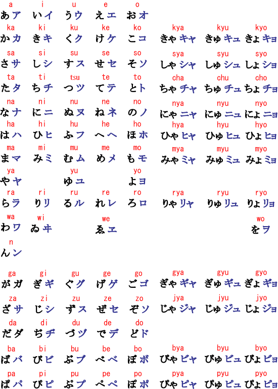

# Hiragana/Katakana

## Hiragana/Katakana

Japanese uses three different writing systems/scripts, **hiragana**, **katakana**, and **kanji**.

**Hiragana**\(平假名\) is the most basic Japanese syllabary. It's like an alphabet that uses **syllables** instead of individual **sounds**.

> In English, each letter usually represents one sound, like k or s. But hiragana characters each represent a syllable.
>
> Japanese syllables are usually just a consonant followed by a vowel(father, see food pet open), like ku or sa. 
>
> There are a few exceptions. The vowels can appear by themselves, like with 
> い (i). There’s also a singular consonant, ん (n). Also, keep in mind that ch and sh count as one consonant sound, even though they’re spelled with two letters! 

**Katakana**\(片假名\) is the syllabary used to write foreign words and some noises. Although it's different from hiragana, it represents the exact same **syllables**.

**Kanji**\(漢字\) are Chinese characters used in the Japanese language to write individual nouns, verbs, and adjectives. Kanji are not phonetic, meaning you need to memorize each pronunciation individually.

Below are the most basic table of Japanese hiragana and katakana.

＞r-l zh ch sh-j q x

**Tips**:

| Japanese | IPA, Notes |
| :--- | :--- |
| 1うウ | \[ɯ\], like the _oo_ in _food_ _noon_ _cool_, with unrounded lips, more relaxed |
| 3し シ shiじ ji | \[ɕi\], like the _shee_ in _sheep_ |
| 3す ス | \[sɯ\], although it can shorten to more of a \[s\] at the end of a word |
| 4 ち チ chi  ji | \[tɕi\], like the _tch_ in itchy |
| 4 つ ツ tsu  zu | \[tsɯ\], like the _ts_ in _cats/rats_ |
| 6 は | \[ha\], pronounced like **wa** as a particle |
| 6 ひ ヒ | \[çi\], like the _h_ in _human_ |
| 6 ふ フ fuぶ bu | \[ɸɯ\], roughly between a short "hoo" and "foo", "f" |
| 6 へ | \[he\], pronounced like \[e\] or "eh" as a particle |
| を ヲ | \[o\], although it's most often romanized as "wo" |
| ん ン | \[n\] or \[ŋ\], like the _n_ in _pink_, producing a \[m\] when combined with a bilabial\(hmp, 双唇音\) stop, hence "tempura" and not "tenpura".  As the only solitary consonant in hiragana, **ん** is especially notable because it is only found at the end of another syllable. In other words, you will never read a Japanese word that begins with **ん**。 |
| ー | long vowel mark, used to extend the vowel sound that precedes it |
| ジ  ヂ | dʑi\], like the _jee_ in _jeep_ |

## Dakuten & Small tsu

> Mnemonics
>
> Rakuten: 乐天株式会社

Putting two little dots/lines \(called Dakuten\) at the upper(top) right corner changes the pronunciation of Hiragana in the following way:

| Sound | Sound with ゛ | Example |
| :--- | :--- | :--- |
| k | g | か \(ka\) → が \(**ga**\) |
| s | z | さ \(sa\) → ざ \(**za**\), し \(shi\) → じ \(**ji**\)\* |
| t | d | た \(ta\) → だ \(**da**\), ち(chi) →  ぢ(**ji**)*, つ \(tsu\) → づ \(**zu**\)\* |
| h | b | は \(ha\) → ば \(**ba**\), ふ(fu) → ぶ(**bu**)* |

Putting this small circle゜ \(called Handakuten\) at the upper right corner changes the pronunciation of Hiragana h group in the following way:

| Sound | Sound with ゜ | Example |
| :--- | :--- | :--- |
| h | p | は \(ha\) → ぱ \(**pa**\) |

Putting っ \(small tsu\) between two Hiraganas doubles the letter right after っ and introduces a short pause between two sounds. When you see this，it means you have to hold the next consonant longer than normal, Examples:

| Without っ | With っ |
| :--- | :--- |
| きて \(kite\) | きって \(ki**tt**e\) |
| もと \(moto\) | もっと \(mo**tt**o\) |
| あさり \(asari, 蛤\) | あっさり \(a**ss**ari\) |

Lastly, this skill introduces the big and small versions of three sounds in hiragana. A small や、ゆ、or よ changes the pronunciation of a word in the following way:

> And notice that **cha** is a bit of an exception, since it doesn’t include the **y**!

| Big や-ゆ-よ | Small や-ゆ-よ |
| :--- | :--- |
| きや \[ki-ya\] | きゃ \[kya\] |
| きゆ \[ki-yu\] | きゅ \[kyu\] |
| きよ \[ki-yo\] | きょ \[kyo\] |

The small character changes the two-syllable construction into a one-syllable construction. Sometimes, the difference can lead to a real change in meaning, as shown below:

| Big よ | Small よ |
| :--- | :--- |
| びよういん \[bi-yō-in\] "beauty salon, 美容院" | びょういん \[byō-in\] "hospital, 病院" |

## Katakana characters

If you sound out the words below using katakana characters, you might find some familiar words! Some of the pronunciation is a little different than its English equivalent, though.

| Japanese   | Romaji    | English                                     |
| ---------- | --------- | ------------------------------------------- |
| カメラ     | kamera    | camera                                      |
| アフリカ   | Afurika   | Africa                                      |
| フランス   | Furansu   | France                                      |
| メキシコ   | Mekishiko | Mexico                                      |
| アメリカ   | Amerika   | the US / America / アメリカ人です(American) |
| マリア     | Maria     | Maria (female given name)                   |
| エリカ     | Erika     | Erika (female given name)                   |
| マリオ     | Mario     | Mario (male given name)                     |
| マドリード | Madoriido | Madrid                                      |

Just be careful - not all words written in katakana were taken from English!

| Japanese | Romaji  | English                                          |
| -------- | ------- | ------------------------------------------------ |
| イギリス | Igirisu | the UK / the United Kingdom / inglês(Portuguese) |
| イタリア | Itaria  | Italy / Italia(Italian)                          |
| ローマ   | Rōma    | Rome / Roma(Italian)                             |

Not all foreign loan words in Japanese are directly equivalent to their English counterparts! For instance, in Japanese **アメリカ** (Amerika) isn't commonly used to refer to all of North America or to both North and South America - it's used almost exclusively to mean "the United States."

However, **イギリス** (Igirisu) can be used to refer to both "the UK" and "England."

