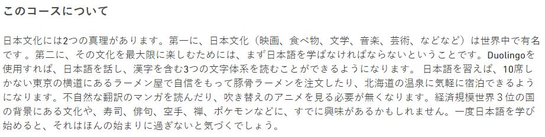

 Home 1 - Unit 8 - routines

# Japanese

Did you know？There are more than 120 million speakers of Japanese！You can tell just by looking that it's a pretty different language from English，but don't worry.

While many consider Japanese to be very difficult to learn for native English speakers, this is only partially true. Many aspects of the Japanese language are quite simple, such as the sound system, and yes, even most of the grammar.

We'll get started with the basics and help you through the tricky spots.

Japanese Tutorial: [https://www.learn-japanese-adventure.com/](https://www.learn-japanese-adventure.com/)

## JP Tutorial

* Japanese Hiragana: [https://www.omniglot.com/writing/japanese\_hiragana.htm](https://www.omniglot.com/writing/japanese_hiragana.htm)
* On'yomi & Kun'yomi 音読み, 訓読み：[https://www.japanesewithanime.com/2016/12/kunyomi-onyomi-kanji-meaning-differences.html](https://www.japanesewithanime.com/2016/12/kunyomi-onyomi-kanji-meaning-differences.html)

Grammar:

* [https://jlptsensei.com/](https://jlptsensei.com/)
* [https://www.learn-japanese.info/](https://www.learn-japanese.info/)

Tutorial:  🌸 [https://www.japaneseprofessor.com/](https://www.japaneseprofessor.com/)

 🌸 Learn Japanese with ANIME: [https://www.japanesewithanime.com/](https://www.japanesewithanime.com/)  

FAQ - sci.lang.japan Frequently Asked Questions: [https://www.sljfaq.org/afaq/afaq.html](https://www.sljfaq.org/afaq/afaq.html)

## JP Dictionaries

Japandict: [https://www.japandict.com/](https://www.japandict.com/)

Jisho: [https://jisho.org/](https://jisho.org/)

> Jisho is a powerful Japanese-English dictionary. It lets you find words, kanji, example sentences and more quickly and easily.

romajidesu: https://www.romajidesu.com/

Forum: [https://japanese.stackexchange.com/](https://japanese.stackexchange.com/)

## JP Refs

* Duolingo Tips and Notes Wiki : 

  旧版本网页的知识集

 	[https://duome.eu/tips/en/ja](https://duome.eu/tips/en/ja)
 	[https://duonotes.fandom.com/](https://duonotes.fandom.com/)

* Tips on Learning JP\(Duolingo Mobile\)

