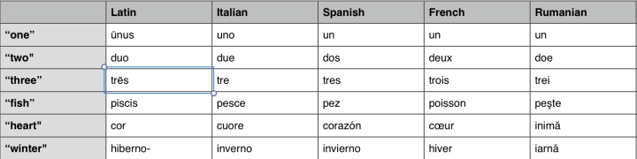

# Japanese

While many consider Japanese to be very difficult to learn for native English speakers, this is only partially true. Many aspects of the Japanese language are quite simple, such as the sound system, and yes, even most of the grammar.

Japanese Tutorial: [https://www.learn-japanese-adventure.com/](https://www.learn-japanese-adventure.com/)

## Dictionionaries

Japandict: https://www.japandict.com/