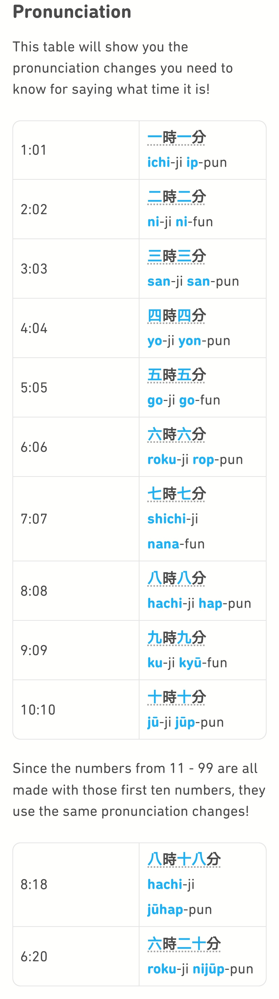

# Weather and Time\(jp\)

Many words in Japanese can be written in either hiragana or kanji(though depending on the word, one way is often more common than the other).

 Just count the lines!

|      | Japanese   | Hiragana |
| :--- | :--------- | :------- |
| 0.   | ゼロ       | zero     |
| 1.   | いち       | ichi     |
| 2.   | に         | ni       |
| 3.   | さん       | san      |
| 4.   | よん       | yon      |
| 5.   | ご         | go       |
| 6.   | ろく       | roku     |
| 7.   | なな       | nana     |
| 8.   | はち       | hachi    |
| 9.   | きゅう     | kyuu     |
| 10.  | じゅう     | jyuu     |
| 11.  | じゅういち | jyuuichi |
| 12.  | じゅうに   | jyuuni   |
| 20.  | にじゅう   | nijyuu   |
| 30.  | さんじゅう | sanjyuu  |
| 100. | ひゃく     | hyaku    |

Keep in mind，numbers sometimes change pronunciation a bit, like with一分(いっぷん, ippun)

Depending on context，四 can be read as yon or shi，七 can be nana or shichi，and 九 can be ku or kyuu！
Zero, on the other hand, is written in katakana because the word comes from a foreign language！

> In Japanese, you just combine the numbers above to make bigger numbers. 

## Time

To ask **What time is it？**in Japanese，say 何時ですか？

To give an answer，just say the number and add 時！

| Kanji | Meaning                    | Kunyomi Reading  | Onyomi Reading      |
| :---- | :------------------------- | :--------------- | :------------------ |
| 一    | One                        | ひと•つ Hito•tsu | いち                |
| 二    | Two                        | ふた•つ          | に                  |
| 三    | Three                      | みっ•つ          | さん                |
| 時    | Time, literally means hour | とき toki        | じ ji               |
| 今    | Now                        | いま             | こん                |
| 分    | Minute, Part               | わ•かる Wa• karu | ふん、ぶん Fun, bun |
| 半    |                            | はん             |                     |

For a more precise time including minutes, you follow the same pattern you do with hours. So 1:01 would be one hour one minute. Notice that the pronunciation changes a little bit, depending on the number!

(今は)三時十五分です。（Imawa san-ji jyuugo-fun desu.）

It is 3:15 right now.

**一時ではありません。**

It is not one o'clock.

**今はちょうど十時半です。** (Ima wa chōdo jū-jihandesu.)

It is exactly ten thirty right now.

**八時半ちょうどです。**

It is exactly/just eight thirty.

ひる\(daytime, hiru\) きょう\(today, kyou\) よる\(night, yoru\)

あさ 朝

はれ\(sunny\) くもり\(cloudy\)

なつ\(summer, natsu\) ふゆ\(winter, fuyu\)

