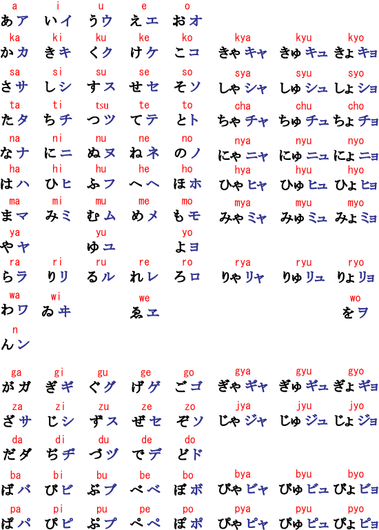

# Introduction\(JP\)

While many consider Japanese to be very difficult to learn for native English speakers, this is only partially true. Many aspects of the Japanese language are quite simple, such as the sound system, and yes, even most of the grammar.

## Hiragana/Katakana

Japanese uses three different writing systems, **hiragana**, **katakana**, and **kanji**.

**Hiragana**\(平假名\) is the most basic Japanese syllabary. It's like an alphabet that uses **syllables** instead of individual **sounds**.

**Katakana**\(片假名\) is the syllabary used to write foreign words and some noises. Although it's different from hiragana, it represents the exact same **syllables**.

**Kanji**\(漢字\) are Chinese characters used in the Japanese language to write individual nouns, verbs, and adjectives. Kanji are not phonetic, meaning you need to memorize each pronunciation individually.

Below are the most basic table of Japanese hiragana and katakana.

**Tips**:

| **Japanese** | **IPA, Notes** |
| :--- | :--- |
| 1うウ | \[ɯ\], like the _oo_ in _food_ _noon_ _cool_ |
| 3し シ | \[ɕi\], like the _shee_ in _sheep_ |
| 3す ス | \[sɯ\], although it can shorten to more of a \[s\] at the end of a word |
| 4ち チ | \[tɕi\], like the _tch_ in _itchy_ |
| 4つ ツ | \[tsɯ\], like the _ts_ in _cats_ |
| 6は | \[ha\], pronounced like **wa** as a particle |
| 6 ひ ヒ | \[çi\], like the _h_ in _human_ |
| 6 ふ フ | \[ɸɯ\], roughly between a short "hoo" and "foo" |
| 6 へ | \[he\], pronounced like \[e\] or "eh" as a particle |
| を ヲ | \[o\], although it's most often romanized as "wo" |
| ん ン | \[n\] or \[ŋ\], like the _n_ in _pink_, producing a \[m\] when combined with a bilabial\(hmp, 双唇音\) stop, hence "tempura" and not "tenpura".  As the only solitary consonant in hiragana, **ん** is especially notable because it is only found at the end of another syllable. In other words, you will never read a Japanese word that begins with **ん**。 |
| ー | long vowel mark, used to extend the vowel sound that precedes it |
| ジ  ヂ | dʑi\], like the _jee_ in _jeep_ |

## Dakuten & Small tsu

> Mnemonics
>
> Rakuten: 乐天株式会社

Putting two little dots \(called Dakuten\) at the upper right corner changes the pronunciation of Hiragana in the following way:

| Sound | Sound with ゛ | Example |
| :--- | :--- | :--- |
| k | g | か \(ka\) → が \(**ga**\) |
| s | z | さ \(sa\) → ざ \(**za**\), し \(shi\) → じ \(**ji**\)\* |
| t | d | た \(ta\) → だ \(**da**\), つ \(tsu\) → づ \(**zu**\)\* |
| h | b | は \(ha\) → ば \(**ba**\) |

Putting this little circle \(called Handakuten\) at the upper right corner changes the pronunciation of Hiragana in the following way:

| Sound | Sound with ゜ | Example |
| :--- | :--- | :--- |
| h | p | は \(ha\) → ぱ \(**pa**\) |

Putting っ \(small tsu\) between two Hiraganas doubles the letter right after っ and introduces a short pause between two sounds. Examples:

| Without っ | With っ |
| :--- | :--- |
| きて \(kite\) | きって \(ki**tt**e\) |
| もと \(moto\) | もっと \(mo**tt**o\) |
| あさり \(asari, 蛤\) | あっさり \(a**ss**ari\) |

Lastly, this skill introduces the big and small versions of three sounds in hiragana. A small や、ゆ、or よ changes the pronunciation of a word in the following way:

| Big や-ゆ-よ | Small や-ゆ-よ |
| :--- | :--- |
| きや \[ki-ya\] | きゃ \[kya\] |
| きゆ \[ki-yu\] | きゅ \[kyu\] |
| きよ \[ki-yo\] | きょ \[kyo\] |

The small character changes the two-syllable construction into a one-syllable construction. Sometimes, the difference can lead to a real change in meaning, as shown below:

| Big よ | Small よ |
| :--- | :--- |
| びよういん \[bi-yō-in\] "beauty salon, 美容院" | びょういん \[byō-in\] "hospital, 病院" |

## Kanji

**Kanji** literally means "Chinese characters," and they're used to build content words like nouns, verbs, and adjectives.

Most kanji have at least two possible readings. Typically, one reading is derived from a native Japanese word, and one reading is derived from a Chinese loanword. These are called "kunyomi" \(meaning reading, **訓読み**\) and "onyomi" \(sound reading, **音読み**\) respectively.

Let's take the kanji for "country," **国**。On its own, we use the Japanese "kunyomi" reading, くに\(kuni\)。In Japanese, くに means "country." However, in compounds, we use the "onyomi" reading of こく\(koku\)。Therefore, China, **中国** or "middle country," is read as ちゅうごく。

So why isn't it ちゅうこく？This is due to a phenomenon known as **rendaku\(连浊\)** or **sequential voicing.** Syllables that come later in a word are sometimes voiced and marked with a dakuten. This is often rather unpredictable, so rendaku words should be memorized individually.

Below is a table of the kanji that are introduced in this lesson, complete with possible readings.

| Kanji | Meaning | Kunyomi Reading | Onyomi Reading |
| :--- | :--- | :--- | :--- |
| 人 | Person | ひとhito | じん jin、にん nin |
| 中 | Middle | なか naka | ちゅう chi~yuu\(Chū\) |
| 国 | Country | くにkuni | こくkoku |
| 日 | Sun, Day | ひ | にち、じつ |
| 本 | Origin, Book | もと moto | ほん hon |
| 田 | Rice Paddy | た ta | でん  den |
| 学 | Education | まな•ぶ | がく gaku |
| 生 | Born, Raw | なま、い•きる | せい sei |
| 先 | Previous | さき saki | せん sen |

| 英   | English  |         | えい         |
| ---- | -------- | ------- | ------------ |
| 語   | Language | かた•る | ご           |
| 何   | What     | なに    |              |
| 名   | Name     | な      | めい、みょう |
| 前   | Before   | まえ    | ぜん         |

You may have noticed that the word Japan, or **日本** is composed of the kanji meaning "sun" and "origin." This word was first adopted by the Chinese, and to them, Japan was off to the east, the place where the sun rose or "originated."

## Basic Grammar

One thing that makes Japanese very different from English is the Japanese tendency to **drop the subject of the sentence** when the meaning is clear from context. Statements usually refer to oneself, while questions usually address the person you're speaking with.

### The Question Marker

Adding question marker **か** at the end will make the affirmative \(positive\) sentence into question. If the sentences end in ～です, it’s easy to formulate questions by using ～ですか。

| Positive | Question |
| :--- | :--- |
| アメリカ人です。\(I’m American.\) | アメリカ人です**か**\(Are you American?\) |
| 中村\(むら/ソン\)です \(I am Nakamura\) | 中村です**か** \(Are you Nakamura?\) |
| がくせいです。\(I’m a student.\) | がくせいです**か**。\(Are you a student?\) |

マリア**さんは** 中国しゅっしんです \(Ms. Maria is from China / Ms. Maria is chinese.\)

* 中国しゅっしんです \(Chūgoku shusshin desu\)
* 中国出身です\(I am from china\)

> **Tips** ：マリア——maria；さん——honorific\(Mr./Mrs.\);はwa——is;しゅっしん——from
>
> **honorific**——To show respect or reverence for a person or concept

**本田\(ほんだ\)**さんは日本人です（Mr. Honda is Japanese）

> 本田 is the Japanese name, Honda, which is both a surname and the car company.
>
> However, the full name of the Honda Motor Corporation is 本田技研工業株式会社. The short version is 本田技研工業. The two Kanji, 本田, would be the shortest way to write Honda, but it can be confused with other Honda names \(surnames and given names\).
>
> 本田 also be pronounced Motoda, Honden, or Honta \(various surnames in Japan written the same way, but pronounced differently\).
>
> Technically, the word honda means rice paddy.

**ジョン** さんは アメリカ人です（john is american）

### Negative

Here is the table of possible ways to say "is not/ wasn't":

|          | では PRESENT                           | じゃあ PRESENT                         | では PAST                                         | じゃあ PAST                                       |
| -------- | -------------------------------------- | -------------------------------------- | ------------------------------------------------- | ------------------------------------------------- |
| FORMAL   | ~ではありません  or ~ではないです | ~じゃありません  or ~じゃないです | ~ではありませんでした   or ~ではなかったです | ~じゃありませんでした   or ~じゃなかったです |
| INFORMAL | ~ではない                              | ~じゃない                              | ~ではなかった                                     | ~じゃなかった                                     |

> じゃあ is less formal than では however, じゃあ sounds easier to say so it is most commonly used in conversational Japanese.

| Japanese                                        |                           |
| ----------------------------------------------- | ------------------------- |
| アメリカ人ではありません。                      | I’m not American.         |
| 私は学生ではありません / 私は学生じゃないです。 | I'm not a student.        |
| 私も学生です                                    | I’m also a student.       |
| マリアさんも学生です                            | Maria is `also` a student |

### What are you speaking?

フランス語が話せますか？

- Can you speak French?

> https://forum.duolingo.com/comment/36961184/Can-you-speak-French  @DaemonBeats
>
> Alright, I'll try to explain this answer. Japanese sentence structure is SOV/Subject, Object, Verb.
>
> We start off with the object of the sentence, フランス語. This simply means "French." Feel free to put あなたは ("you + は," the subject of the sentence/question) or another form of address like a name, before French here, but the person you're asking most likely knows you're asking THEM the question, so it's not needed in the sentence and it's easier. Since the Subject is implied not included in the sentence, and French is the Object, it is first. SOV
>
> Then, we have the particle が. Think of it as a word that puts emphasis on what comes before it and connects it to what's after, and is often introducing what comes before it. In this case, you're asking the person if it's FRENCH that they can speak. French is probably just being introduced to the conversation, or brought back to attention. This question may prompt the answer to be something like "No, I don't speak French, but I can speak..." the new idea in the sentence is (French), and perhaps you were already talking about speaking other languages beforehand.
>
> If you use は instead of が, it puts more emphasis on what it is introduced after it. If it was used in this question, French would probably already be the topic of the conversation, and you'd be asking along the lines of "oh! Speaking of French, can you speak it?" The new idea is (the speaking) of French.
>
> Lastly, 話せます (はなせます). I've more often heard 話します (はなします), with a し, which means "I DO speak..." //whilst with the せ means "I CAN speak."
>
> ます is usually used in a sentence when a verb is the last part of a sentence, instead of です. 'か', when at the end of a sentence, turns it into a question. If か is present, do not use a question mark.
>
> In short, for the sentence:
>
> Subject(Implied listener, not included) + Object(フランス語) +(が) + Verb(話せますか)
>
> Particles are a bit tricky in Japanese, but hang in there and you'll get it!

英語は話\(はな\)せますか？

* Eigo wa hanasemasuka?
* Can you speak English?

私は英語が話せます。

- I can speak English.

日本語がはなせます。

* Nihongo ga hanasemasu.
* I can speak japanese.

田中先生は日本語と英語がはなせます。

* Mr. Tanaka can speak Japanese and English. 

### Pronouns 

Pronouns are relatively rare in Japanese, but they are sometimes used to explicitly specify the subject or topic of a sentence. Below are some of the most common ones.

| Japanese | Hiragana | English | Notes |
| :--- | :--- | :--- | :--- |
| 私 | わたし | I, me | Used in polite settings by women and men, used by women in most other settings |
| 僕 | ぼくboku | I, me | Used by men in informal settings |
| 私たち | わたしたち | we, us |  |
| 我々 | われわれ |  | sounds rather stiff and business-like. |
|  | あなた | you | あなた is used in polite settings, If you know someone's name, it's best to call someone by their name, typically followed by さんor せんせい。あなた**たち** is used in formal settings. |
| 君 | きみ |  | Used by men in informal settings, specifically to those on or beneath one's social level. 君**たち** is used in informal settings, especially to subordinates. |
| 彼 | かれ | he, him | Can also mean "boyfriend" |
| 彼女 | かのじょ | she, her | Can also mean "girlfriend" |
| 彼ら | かれら kanera | they, them | Used for an all-male or mixed-gendered group |
| 彼女たち | かのじょたち kanojyo tachi | they, them | Used for an all-female group |

### Verbs

| JP |  | JP |  |
| :--- | :--- | :--- | :--- |
| よむ yomu | read |  |  |
| のむ nomu | drink | きる kiru | wear |
| すき suki | like | ほしい | want |
|  |  |  |  |

